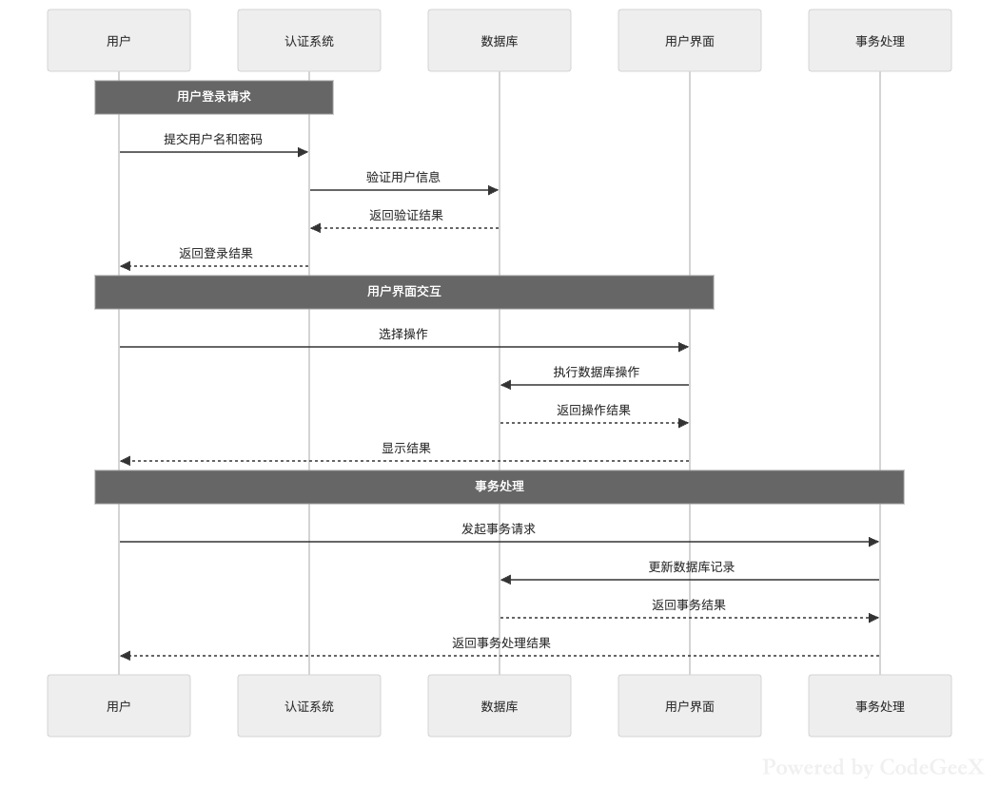
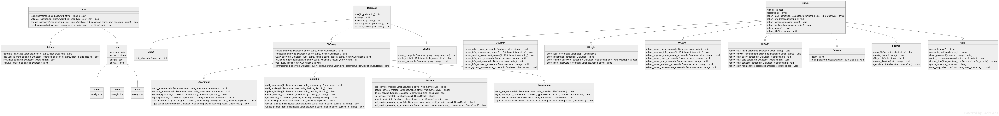

# 物业管理系统

## 目前在做的事

大家把自己正在写以及写完了的东西写在下面，免得写重了

dch：

ptc：
- 我在下面的项目总要求里添加了数据库的表单数据结构预期实现，请按照那个作为预期的数据库结构
- user_id是字符串！(至少需要40位的数组来存放)

- [x] apartment.c 已完成，实现增删查改房屋功能
- [x] building.c 已完成，实现楼宇的增删查改
- [x] transaction.c 已初步完成，实现交易记录的添加
- [x] parking.c
- [x] service.c 
以上函数由我负责维护，有需求请联系我
fxl：

zzm：

## 项目指北

[项目开发指南](./doc/guide.md)

[项目总要求](./doc/require.md)

[SQLite 如何使用 C 语言调用？](https://zetcode.com/db/sqlitec)

同时，你可以在名为 practice 的 branch 里进行开发的练习（可以在 Github Desktop 中切换）





## 快速开始

### 使用 Windows 开始

最简便的方式是直接下载 Visual Studio 和 Github Desktop

先使用 github desktop 克隆(clone)下本仓库，然后使用 vs 从文件夹打开，打开本项目，VS 应当会配置好所有内容，可以直接开始

请**务必**挂上梯子或者有良好的网络环境（如校园网）

请在 VS 的扩展商店搜索并安装`force utf-8`插件，来统一项目中文编码（需要推出 VS 来完成插件安装）

### 使用 Linux 开始

#### 安装所需的必要软件

- gcc
- git
- cmake
- ninja

ubuntu 下仅需：

```bash
sudo apt-get install -y ninja-build git gcc cmake pkg-config
```

#### 安装 vcpkg 并进行必要配置

选择一个你喜欢的地方拉下 vcpkg，并执行编译安装脚本

```bash
git clone https://github.com/microsoft/vcpkg.git

cd vcpkg && ./bootstrap-vcpkg.sh
```

然后你需要将你的 vcpkg 安装位置写入环境变量

```bash
export VCPKG_ROOT=/path/to/vcpkg
export PATH=$VCPKG_ROOT:$PATH
# 如需永久存在，请写入.bashrc或.zshrc
```

然后你应该拉下本项目并额外配置 cmake 参数来使用 vcpkg

在此项目根目录下创建 CMakeUserPresets.json 文件，内容如下：

```json
{
  "version": 2,
  "configurePresets": [
    {
      "name": "default",
      "inherits": "vcpkg",
      "environment": {
        "VCPKG_ROOT": "引号内填入vcpkg文件夹的绝对路径"
      }
    }
  ]
}
```

#### 使用 cmake 构建

使用 CMake 配置构建，过程中需要梯子

```bash
cmake --preset=default
```

然后生成项目

```bash
cmake --build build
```

然后就能在 build 文件夹下看到构建好的文件了

#### 也可以直接使用脚本来构建和测试

运行:

```bash
./build.sh
```

然后：

```bash
./run.sh
```
## 初始化工作环境 $^{*}$

1. 根据您的操作系统及CPU指令架构，在仓库根目录下的 `.filter-tools` 目录中选择对应的文件，记录其文件名 $^{**}$
2. 在克隆的仓库中启动终端，使用以下命令在仓库中使用如下命令添加Filter

        # 仅替换 `<platform>` `<arch>` 为您的平台，不要更改相对路径
        ## 除非你知道你在做什么

        git config --local filter.garbage2null.smudge "./.filter-tools/garbage2null-<platform>-<arch>"
        git config --local filter.garbage2null.clean "./.filter-tools/garbage2null-<platform>-<arch>"